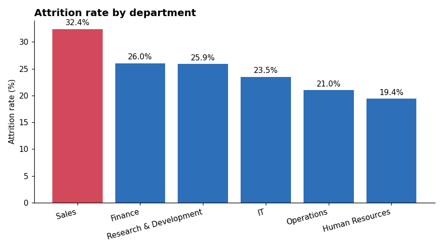
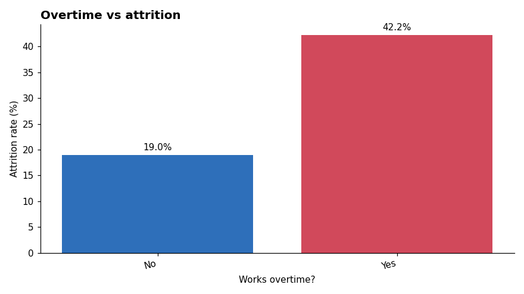
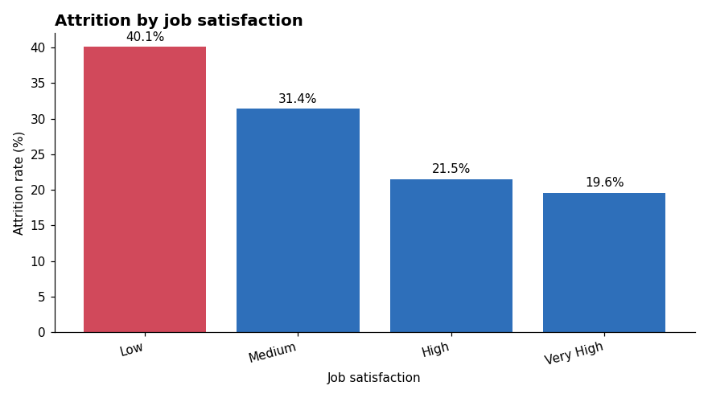
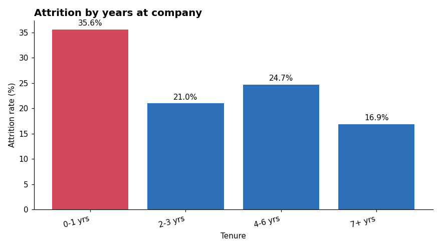
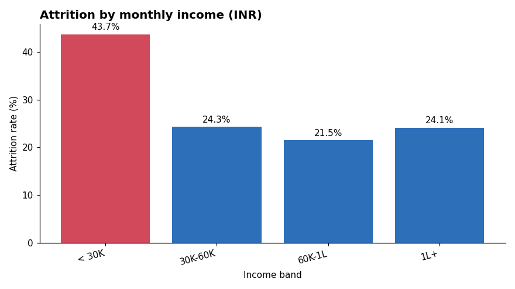
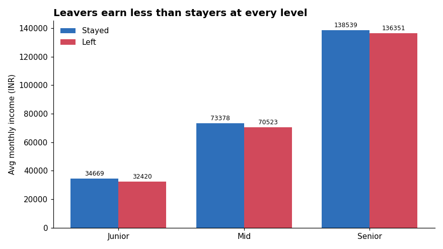

# HR Employee Attrition Analysis

A beginner business analyst project that answers one question for an HR team:
**Why are employees leaving, and who is most at risk of leaving next?**

The data is stored in a **SQLite** database, analysed with **10 SQL queries**, and the results are
turned into charts and recommendations with **Python (pandas + matplotlib)**.

> The dataset is synthetic (1,500 fictional employees) and generated by `data/generate_data.py`
> with a fixed seed, so every result below can be reproduced exactly.

---

## Business questions

| # | Question | SQL skills used |
|---|----------|-----------------|
| 1 | What is the overall attrition rate? | `COUNT`, `SUM`, `AVG`, `CASE` |
| 2 | Which departments lose the most people? | `GROUP BY`, `ORDER BY` |
| 3 | Does overtime increase attrition? | `GROUP BY` |
| 4 | How does job satisfaction relate to attrition? | `CASE` labels |
| 5 | Are new joiners more likely to leave? | `CASE` bands |
| 6 | Does salary affect attrition? | `CASE` bands |
| 7 | Do leavers earn less than stayers? | conditional `AVG` |
| 8 | Which job roles are highest risk? | `HAVING`, `LIMIT` |
| 9 | Which departments are above the company average? | subquery |
| 10 | How many current employees fit the high-risk profile? | CTE (`WITH`) |

All queries are in [`sql/analysis_queries.sql`](sql/analysis_queries.sql).

---

## Key numbers

| Total employees | Employees who left | Attrition rate | Avg monthly income | Avg tenure |
|---|---|---|---|---|
| 1,500 | 395 | **26.3%** | ₹60,310 | 3.8 years |

## Findings

**1. Sales has the highest attrition (32.4%)** – the only department above the company average of 26.3%.
Sales Executives are the single highest-risk role (36.4%).



**2. Overtime more than doubles attrition** – 42.2% of employees working overtime left vs 19.0% of those who don't.



**3. Low job satisfaction = high attrition** – 40.1% of "Low" satisfaction employees left vs 19.6% of "Very High".



**4. The first year is the riskiest** – 35.6% of employees with 0–1 years' tenure left; it falls to 16.9% after 7+ years.



**5. Pay matters most at the bottom** – employees earning under ₹30K/month left at 43.7%, and leavers earned less than stayers at every job level.




## Recommendations

1. **Control overtime** – set overtime limits and review workload in teams where overtime is common.
2. **Fix onboarding** – add a buddy/mentor programme and 30-60-90 day check-ins for new joiners.
3. **Focus on Sales** – review targets and incentive structure for Sales Executives.
4. **Review entry-level pay** – benchmark salaries below ₹30K against the market.
5. **Act on satisfaction surveys** – follow up quickly with employees who score 1–2.
6. **Monitor the 24 current high-risk employees** (overtime + low satisfaction + poor work-life balance) identified by Query 10.

---

## Project structure

```
hr-attrition-analysis-sql-python/
├── data/
│   ├── generate_data.py      # creates the synthetic dataset
│   └── employees.csv         # 1,500 employee records
├── sql/
│   ├── schema.sql            # table definition
│   └── analysis_queries.sql  # 10 business queries
├── src/
│   ├── load_to_sqlite.py     # CSV -> SQLite + data-quality checks
│   └── analysis.py           # runs SQL from Python, makes charts
├── images/                   # charts used in this README
├── outputs/                  # query results as CSV
└── requirements.txt
```

## How to run

```bash
pip install -r requirements.txt
python data/generate_data.py     # 1. create the dataset
python src/load_to_sqlite.py     # 2. load it into SQLite (hr_attrition.db)
python src/analysis.py           # 3. run SQL queries + save charts
```

## Tools

**SQL (SQLite)** · **Python** · **pandas** · **matplotlib** · **NumPy**

## What I learned

- Writing SQL with aggregations, `CASE`, `HAVING`, subqueries and CTEs
- Connecting Python to a database and running SQL from pandas
- Turning query results into charts and business recommendations
